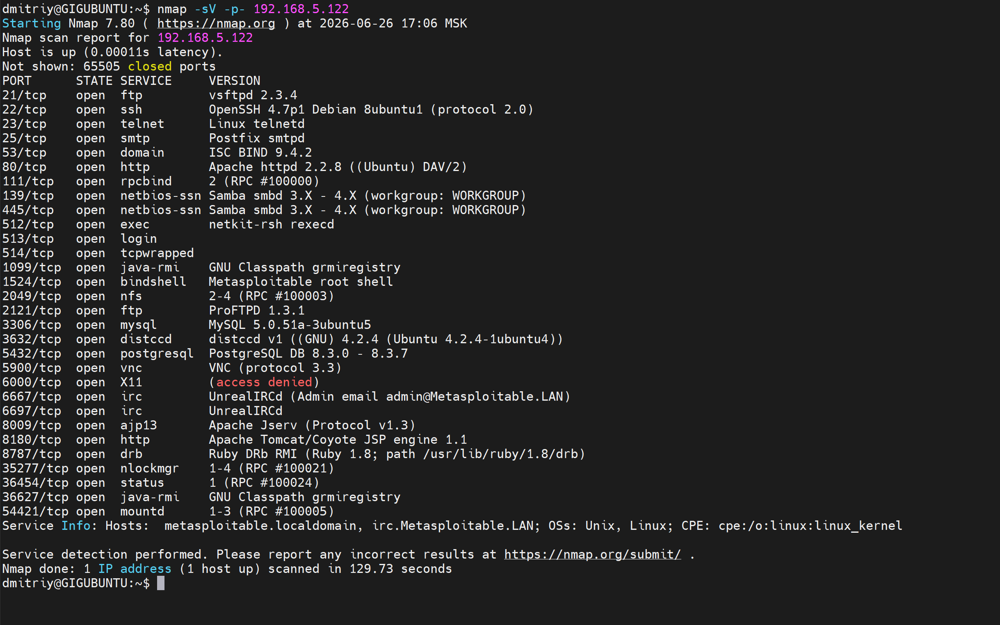
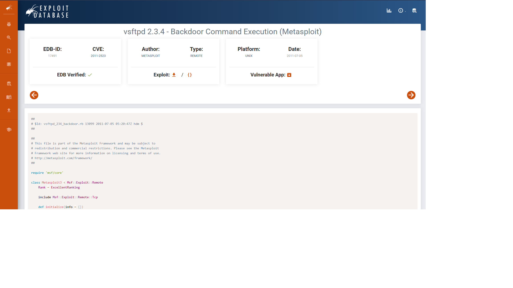
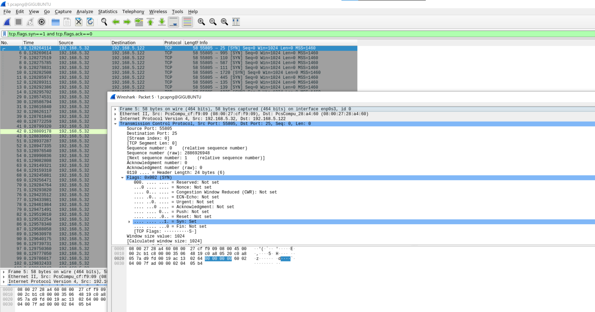

## Задание 1. Сканирование и поиск уязвимостей

IP-адрес машины: **192.168.5.122**.

### Результат сканирования nmap

Команда:
nmap -sV -p- 192.168.5.122

**Открытые сетевые службы:**

### Найденные уязвимости

#### 1. vsftpd 2.3.4 — Backdoor Command Execution
- **CVE:** CVE-2011-2523
- **EDB-ID:** 17491
- **Описание:** скомпрометированная версия архива vsftpd содержит встроенный backdoor, позволяющий получить root-доступ.

#### 2. UnrealIRCd 3.2.8.1 — Backdoor Command Execution
- **CVE:** CVE-2010-2075
- **EDB-ID:** 16922
- **Описание:** заражённый дистрибутив IRC-сервера содержит backdoor, позволяющий выполнять произвольные shell-команды.

#### 3. DistCC Daemon — Command Execution
- **CVE:** CVE-2004-2687
- **EDB-ID:** 9915
- **Описание:** демон распределённой компиляции принимает задания без авторизации, что позволяет удалённо выполнять произвольные команды.

---

## Задание 2. Анализ режимов сканирования в Wireshark

### Описание
Сканирование Metasploitable (192.168.5.122) проводилось в 4 режимах: SYN, FIN, Xmas, UDP.
Сетевой трафик записывался в Wireshark на интерфейсе `enp0s3`.

### 1. SYN-скан
Команда: `nmap -sS 192.168.5.122`

Отправляется один пакет с флагом **SYN**. Соединение не завершается полностью (half-open scan).

### 2. FIN-скан
Команда: `nmap -sF 192.168.5.122`

Отправляется одиночный пакет с флагом **FIN** без предварительного handshake.

### 3. Xmas-скан
Команда: `nmap -sX 192.168.5.122`

Пакет содержит одновременно три флага: **FIN + PSH + URG**.

### 4. UDP-скан
Команда: `nmap -sU -p 1-100 192.168.5.122`

Отправляются пустые UDP-датаграммы; сервер отвечает **ICMP Destination Unreachable (Port Unreachable)** на закрытые порты.

**Отличия по трафику:**
- SYN — один пакет, флаг SYN, без завершения соединения.
- FIN — один пакет, флаг FIN, без предварительного handshake.
- Xmas — один пакет с комбинацией флагов FIN+PSH+URG.
- UDP — датаграмма без флагов (у UDP флагов нет в принципе).

**Ответы сервера:**
- На SYN сервер отвечает SYN-ACK (порт открыт) или RST-ACK (порт закрыт).
- На FIN и Xmas Linux-система (как в Metasploitable) в большинстве случаев не отвечает на открытые порты, что отличается от классического поведения по RFC 793.
- На UDP сервер отвечает ICMP Port Unreachable для закрытых портов; для открытых портов ответа может не быть вовсе либо отвечает само приложение.
